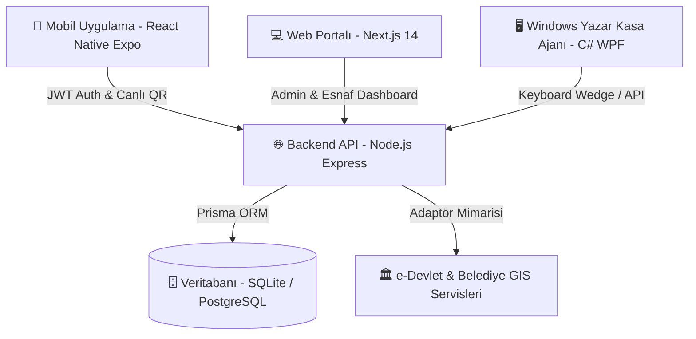

# 🏛️ TRABZON ORTAHİSAR BELEDİYESİ
## Genç Kart & Akıllı Şehir Esnaf İndirim Ekosistemi — Staj & Proje Raporu

---

### 📋 Proje Künyesi
* **Proje Sahibi Kurum:** Trabzon Ortahisar Belediyesi (Bilgi İşlem / Akıllı Şehir Müdürlüğü)
* **Proje Adı:** Ortahisar Genç Kart & Akıllı Esnaf İndirim Sistemi (Web, Mobil, Backend, Masaüstü Ajanı)
* **Geliştirici / Stajyer:** Yusuf Tan DURMUŞ
* **Proje Versiyonu:** `v2.2.0 (Production-Ready Architecture)`
* **Kaynak Kod Deposu:** [GitHub - YusufTanDURMUS/ortahisar-genckart](https://github.com/YusufTanDURMUS/ortahisar-genckart)
* **Tarih:** Ağustos 2026

---

## 1. GİRİŞ VE PROJENİN AMACI

### 1.1. Problem Tanımı
Geleneksel belediyecilik hizmetlerinde öğrencilere ve gençlere yönelik indirim/destek mekanizmaları genellikle fiziksel kartlar, kağıt kuponlar veya karmaşık başvuru süreçleriyle yürütülmektedir. Bu geleneksel yöntemler şu temel sorunlara yol açmaktadır:
1. **Fiziksel Kart Maliyeti ve Kayıp Riski:** Kart basım masrafları, kayıp/çalıntı durumunda kart yenileme gecikmeleri.
2. **Kötüye Kullanım ve Başkasının Kartını Kullanma:** Fiziksel kartların veya ekran görüntüsü olarak iletilen sabit QR kodların başkaları tarafından kolayca kullanılması.
3. **Öğrencilik ve İkamet Şartlarının Güncelliğini Yitirmesi:** Mezun olan, yaş sınırını aşan veya ilçeden taşınan kişilerin denetlenememesi.
4. **Esnaf Cephesinde Entegrasyon Zorluğu:** Yerel esnafların pahalı POS yazılımları veya karmaşık cihazlar satın almadan indirim uygulayamaması.
5. **Veri ve Şeffaflık Eksikliği:** Belediyenin hangi sektörde ne kadar indirim yapıldığını, gençlere ne kadarlık ekonomik katkı sağlandığını anlık takip edememesi.

### 1.2. Projenin Hedefleri ve Çözüm Yaklaşımı
**Ortahisar Genç Kart Projesi**, Trabzon Ortahisar ilçesinde yaşayan veya eğitim gören gençlerin (15–25 yaş) yerel esnaflarla buluşmasını sağlayan, uçtan uca modern bir dijital ekosistemdir.

* **Gençler İçin:** Telefonlarında çalışan, 60 saniyede bir otomatik yenilenen güvenli dinamik QR kodlu dijital kart. Ganita, Boztepe, Kalkınma, KTÜ Kampüsü gibi simge merkezlerdeki anlaşmalı işletmeleri harita ve kategoriyle keşfetme imkanı.
* **Esnaflar İçin:** Herhangi bir cihaz gerektirmeden ister tarayıcı üzerinden (PWA Satış Terminali) ister Windows masaüstü POS entegrasyon ajanıyla (Keyboard Wedge) anında indirim uygulama ve şube/oran talepleri iletme altyapısı.
* **Belediye / Admin İçin:** Kayıtlı gençleri, anlaşmalı işletmeleri, mahalle ve cadde bazlı adresleri, esnaf taleplerini ve esnafların sağladığı toplam TL indirim tutarını tek bir kontrol merkezinden denetleme olanağı.

---

## 2. HEDEF KİTLE VE UYGUNLUK (ELIGIBILITY) KOŞULLARI

Sistem, adil ve şeffaf bir sosyal yardım/destek mekanizması sağlamak amacıyla katı uygunluk kurallarına göre modellenmiştir:

```
                  ┌──────────────────────────────────────────────┐
                  │          GENÇ KART UYGUNLUK SÜZGEÇLERİ        │
                  └──────────────────────┬───────────────────────┘
                                         │
                 ┌───────────────────────┼───────────────────────┐
                 ▼                       ▼                       ▼
         [ 1. YAŞ ŞARTI ]       [ 2. ÖĞRENCİLİK ]        [ 3. ORTAHİSAR BAĞI ]
          15 - 25 Yaş Arası      Lise veya Üniversite     Okul Ortahisar'da VEYA
          (15 ve 25 dahil)       Aktif Öğrenci Kaydı      İkametgah Ortahisar'da
```

| Kriter | Kapsam & Açıklama | Denetim Yöntemi |
| :--- | :--- | :--- |
| **1. Yaş Kriteri** | **15 – 25 yaş aralığı** (15 ve 25 yaş dahil). | TCKN ve Doğum Yılı üzerinden MERNİS / Nüfus kontrolü. |
| **2. Öğrenim Kriteri** | **Lise veya Üniversite** (Önlisans, Lisans, Y. Lisans, Doktora) öğrencisi olmak. | e-Devlet YÖK ve MEB Web Servisleri. |
| **3. Lokasyon Kriteri** | **Okulun Ortahisar'da bulunması** (KTÜ, Avrasya Üni, Ortahisar Liseleri vb.) **VEYA** gencin **İkametgah adresinin Ortahisar'da olması**. | Nüfus ve Vatandaşlık İşleri (NVİ) Adres Veritabanı. |

> [!NOTE]
> Başka bir şehirde veya ilçede üniversite okuyan ancak ailesi/evi Trabzon Ortahisar'da ikamet eden gençlerimiz de Genç Kart'tan tam olarak yararlanabilmektedir.

---

## 3. SİSTEM MİMARİSİ VE TEKNOLOJİ YIĞINI

Proje, 4 bağımsız ancak birbiriyle tam entegre çalışan katmandan oluşmaktadır:



### 3.1. Katmanlar ve Kullanılan Teknolojiler

#### 1. Backend Katmanı (`backend/`)
* **Çalışma Ortamı:** Node.js (v18+) & TypeScript
* **Web Framework:** Express.js
* **Veritabanı & ORM:** Prisma ORM (Geliştirmede SQLite `dev.db`, Prodüksiyonda PostgreSQL & PostGIS)
* **Kimlik Doğrulama:** JWT (JSON Web Token), Bcrypt parola şifreleme, RBAC (Rol Tabanlı Yetkilendirme: `STUDENT`, `MERCHANT`, `ADMIN`)
* **Doğrulama & Güvenlik:** 60 saniyelik zaman damgalı TOTP QR hash algoritması, Session tecrit middleware'i.

#### 2. Web Portalı (`web/`)
* **Framework:** Next.js 14 (App Router) & React 18
* **Stil & Tasarım:** Tailwind CSS, Lucide React İkonları, Cam Efekti (Glassmorphism), Açık Mavi & Doğa Teması (`#f0f9ff`, `#0284c7`, `#38bdf8`)
* **Rotalar:**
  * `/`: Karşılama Sayfası ve Kültürel Rotalar Vitrini (Ganita, Boztepe, Zağnos, KTÜ)
  * `/admin/login` & `/admin/dashboard`: Belediye Yönetim Paneli
  * `/esnaf/login` & `/esnaf`: Esnaf QR Okutma ve Satış Terminali (PWA)

#### 3. Mobil Uygulama (`mobile/`)
* **Framework:** React Native (Expo SDK 52)
* **Navigasyon:** `@react-navigation/bottom-tabs` & `@react-navigation/native`
* **Görsel & Kod Modülleri:** `react-native-qrcode-svg`, `react-native-barcode-svg` (Code128 Barkod), `expo-brightness` (Ekran açıldığında otomatik %100 parlaklık artırma)
* **Oturum Yönetimi:** `@react-native-async-storage/async-storage`

#### 4. Masaüstü Entegrasyon Ajanı (`windows-agent/`)
* **Framework:** C# .NET 7/8 WPF (Windows Presentation Foundation)
* **Donanım Uyumluluğu:** USB 2D Barkod Okuyucu (Keyboard Wedge) desteği
* **Yazar Kasa Köprüsü:** `SendKeys` & Win32 API ile mevcut yazar kasa/ERP yazılımlarına klavye tuş vuruşu gönderme.

---

## 4. VERİTABANI TASARIMI (ENTITY-RELATIONSHIP)

Veritabanı ilişkisel bütünlüğü koruyacak şekilde Prisma şeması üzerinde modellenmiştir:

```
┌─────────────────┐       1:1       ┌────────────────────────┐
│      User       ├─────────────────┤     StudentProfile     │
│ (Ortak Auth DB) │                 │  (TCKN, Okul, İkamet)  │
└────────┬────────┘                 └───────────┬────────────┘
         │                                      │ 1
         │ 1:1                                  │
         ▼                                      ▼ N
┌─────────────────┐       1:N       ┌────────────────────────┐
│ MerchantProfile ├─────────────────┤      Transaction       │
│(Esnaf & Sembol) │                 │(İndirimli Satış Logu)  │
└────────┬────────┘                 └────────────────────────┘
         │ 1:N
         ├──────────────────────────┐
         ▼                          ▼
┌─────────────────┐        ┌─────────────────┐
│  StoreLocation  │        │ MerchantRequest │
│(Şubeler & Adres)│        │(İndirim & Şube) │
└─────────────────┘        └─────────────────┘
```

### 4.1. Veritabanı Tabloları Özeti
1. **`users`:** Ortak kullanıcı tablosu (`id`, `email`, `passwordHash`, `phoneNumber`, `role`).
2. **`student_profiles`:** Öğrenci kimlik ve doğrulama tablosu (`tcKn`, `firstName`, `lastName`, `birthYear`, `schoolName`, `district`, `isEligible`, `statusReason`).
3. **`merchant_profiles`:** İşletme profili (`businessName`, `category`, `symbol`, `address`, `taxNumber`, `defaultDiscountRate`, `qrCodeIdentifier`).
4. **`store_locations`:** Esnafın merkez ve ek şubeleri (`title`, `address`, `symbol`, `isMain`, `latitude`, `longitude`).
5. **`merchant_requests`:** Esnafın yönetimden talep ettiği indirim artırma veya yeni şube açma başvuruları (`type`, `status`, `requestedDiscountRate`, `targetLocationTitle`, `symbol`, `fullAddress`).
6. **`transactions`:** Kasada yapılan tüm indirimli alışverişlerin şeffaf kayıtları (`originalAmount`, `discountRate`, `discountedAmount`, `savedAmount`, `verificationCode`, `status`).

---

## 5. MODÜLLER VE EKRAN DETAYLARI (EKRAN GÖRÜNTÜLERİ)

> [!TIP]
> Aşağıdaki alanlara sistemden alacağınız ekran görüntülerini `docs/screenshots/` klasörüne ilgili dosya adıyla kaydederek ekleyebilirsiniz.

### 5.1. Web Ana Sayfası ve Kültürel Tanıtım Vitrini
Ortahisar'ın doğal ve tarihi mekanlarını gençlerle buluşturan modern karşılama sayfası. Ganita gün batımı, Boztepe seyir terası, Zağnos Vadisi ve KTÜ Kampüs hattı vitrin kartları ile portallara tek tıkla erişim sağlar.


*Şekil 5.1: Web Portalı Karşılama Sayfası ve Kültürel Rotalar.*

---

### 5.2. Admin (Belediye) Yönetim Portalı

#### A) Canlı İstatistik Sayaçları
Belediye yöneticileri sisteme giriş yaptığında canlı sayaçlar üzerinden 4 kritik metriği anlık izler:
* **Anlaşmalı İşletme Sayısı**
* **Onay Bekleyen Esnaf Talepleri**
* **15-25 Yaş Kayıtlı Genç Sayısı**
* **Gençlere Sağlanan Toplam Tasarruf (₺)**


*Şekil 5.2: Admin Paneli Canlı İstatistik Sayaçları.*

#### B) Onay Bekleyen Esnaf Talepleri Denetimi
Esnaflardan gelen indirim oranı yükseltme, yeni şube açma veya adres güncelleme taleplerinin tek tıkla onaylanıp reddedildiği modül.


*Şekil 5.3: Esnaf Talepleri Yönetim Ekranı.*

#### C) İşletmeler Listesi & Esnaf Bazlı Toplam İndirim (₺) Takibi
Her işletmenin kendi seçtiği sembolle (`📚`, `☕`, `🏋️`, vb.) listelendiği ve o işletmenin bugüne kadar **öğrencilere kaç TL indirim uyguladığının** anlık takip edildiği tablo.


*Şekil 5.4: Anlaşmalı İşletmeler ve Toplam İndirim Katkıları.*

#### D) Yeni Esnaf Ekleme & Ortahisar Adres Seçici Modalı
Trabzon Ortahisar'ın 80+ mahallesi ve binlerce caddesiyle entegre çalışan, kilitli il/ilçe mimarisi ve sembol seçiciye sahip yeni işletme kayıt ekranı.


*Şekil 5.5: Yeni İşletme Tanımlama ve Mahalle/Cadde Seçici Modalı.*

#### E) Kullanıcılar Rehberi (Öğrenci, Esnaf, Admin)
Sistemdeki tüm kayıtlı gençlerin TCKN, telefon, doğum yılı, okul ve uygunluk durumlarının görüntülendiği, anlık arama ve rol filtreleme yapılabilen rehber.


*Şekil 5.6: Kullanıcılar Rehberi ve Filtreleme.*

---

### 5.3. Esnaf QR & Satış Terminali (PWA)
Esnafın tarayıcıdan giriş yaparak fatura tutarını girdiği, kameradan gencin dinamik QR kodunu okuttuğu ve indirimli tutarı anında hesaplayıp onayladığı satış ekranı.


*Şekil 5.7: Esnaf QR Satış ve İndirim Onaylama Terminali.*


*Şekil 5.8: Esnaf Şube Seçimi ve Yeni İndirim/Şube Talep Modalı.*

---

### 5.4. Mobil Uygulama Ekranları (React Native Expo)

#### A) Mobil Giriş Ekranı
11 haneli TCKN ve güvenli parola ile hızlı giriş.


*Şekil 5.9: Mobil Giriş Ekranı.*

#### B) Dijital Genç Kart (Dinamik QR & Çizgi Barkod)
Ekran açıldığında telefon parlaklığını otomatik %100 yapan, her 60 saniyede bir güvenlik amacıyla yenilenen ve istenildiğinde optik okuyucular için Çizgi Barkoda (Code128) dönüşebilen dijital kart.


*Şekil 5.10: Dijital Genç Kart Ekranı.*

#### C) Keşfet Ekranı & Kültürel Rotalar
Ganita Sahili, Boztepe, Kalkınma/KTÜ ve Meydan gibi Ortahisar gençlik duraklarını, kategori filtrelerini ve işletmelere tek tıkla Google Maps üzerinden yol tarifi alma butonlarını barındıran keşif ekranı.


*Şekil 5.11: Mobil Keşfet Ekranı.*

#### D) Öğrenci Profil Ekranı
Gencin TCKN, eğitim kurumu, ikametgah ilçesi ve Ortahisar Gençlik Kulübü rozetini içeren profil ekranı.


*Şekil 5.12: Mobil Profil Ekranı.*

---

### 5.5. Windows Masaüstü Yazar Kasa Entegrasyon Ajanı (C# WPF)
Esnafın bilgisayarına kurulan, USB 2D barkod okuyucuyla okutulan Genç Kart kodunu anında API ile doğrulayıp indirim tutarını yazar kasa ekranına sanal klavye tuş vuruşu (`SendKeys`) olarak basan hafif masaüstü servisi.


*Şekil 5.13: Windows Yazar Kasa Entegrasyon Ajanı Arayüzü.*

---

## 6. GÜVENLİK, SESSION İZOLASYONU VE CANLIYA GEÇİŞ MİMARİSİ

### 6.1. Güvenlik Mekanizmaları
1. **Dinamik TOTP Tabanlı QR Kod:** Ekran görüntüsü alınıp arkadaşına gönderilen kodlar en fazla 60 saniye geçerlidir. 60 saniye sonunda kod otomatik geçersiz sayılır.
2. **Rol Tecriti (Session Isolation):** Next.js middleware katmanında Admin oturumu ile Esnaf oturumu birbirinden tamamen ayrıştırılmıştır. Bir sekmede Admin açıkken diğer sekmede Esnaf portalı açıldığında oturumlar birbirine karışmaz.
3. **Parola ve Kimlik Güvenliği:** Tüm parolalar Bcrypt (salt round: 10) ile hashlenerek saklanır. API istekleri JWT Bearer token ile korunur.

### 6.2. Canlıya Geçiş (Production Readiness)
Sistem, belediyenin gerçek kamu altyapılarına bağlanırken kod tabanında köklü değişiklikler gerektirmeyecek **Adaptör Tasarım Kalıbı (Adapter Pattern)** ile geliştirilmiştir:

| Modül | Geliştirme (Test) Ortamı | Canlı Belediye / Kamu Entegrasyonu | Geçiş Yöntemi |
| :--- | :--- | :--- | :--- |
| **e-Devlet / Nüfus** | `MockEDevletAuthAdapter` | `RealEDevletAuthAdapter` (KPS / YÖK Web Servisi) | `.env` dosyasında `AUTH_MODE=REAL` yapılması |
| **Adres / GIS** | `ortahisarAddress.ts` (Statik Liste) | Ortahisar Belediyesi Coğrafi Bilgi Sistemi (GIS API) | REST / SOAP Endpoint URL tanımlanması |
| **Veritabanı** | SQLite (`dev.db`) | PostgreSQL & PostGIS (`docker-compose.yml`) | `DATABASE_URL` bağlantı cümlesinin güncellenmesi |

---

## 7. SONUÇ VE KAZANIMLAR

Ortahisar Belediyesi Genç Kart projesi kapsamında:
* Web, mobil, backend ve masaüstü yazılımlarını içeren 4 katmanlı modern bir akıllı şehir platformu başarıyla hayata geçirilmiştir.
* 15-25 yaş arası lise/üniversite öğrencisi veya Ortahisar'da ikamet eden gençlerin yerel ekonomiye katılımı teşvik edilmiştir.
* Esnaflara hiçbir ek donanım maliyeti çıkarmadan QR ve Barkod ile hızlı indirim uygulama imkanı sağlanmıştır.
* Belediye yönetimine şeffaf denetim, anlık istatistik takibi ve dinamik adres/esnaf yönetimi kazandırılmıştır.
